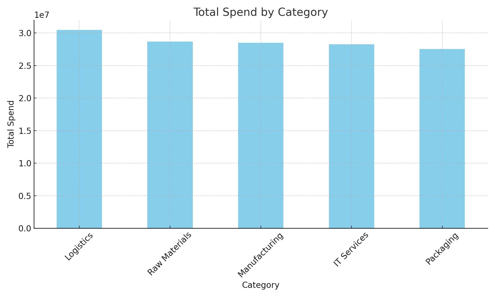
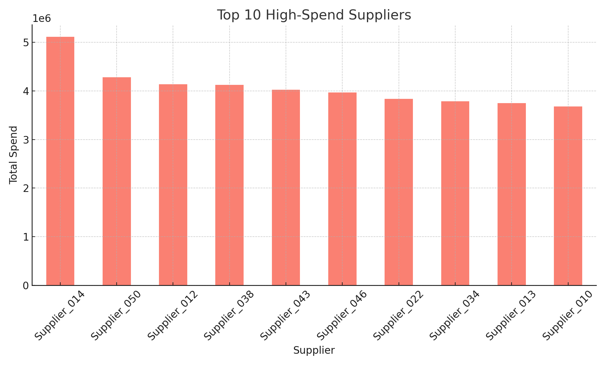
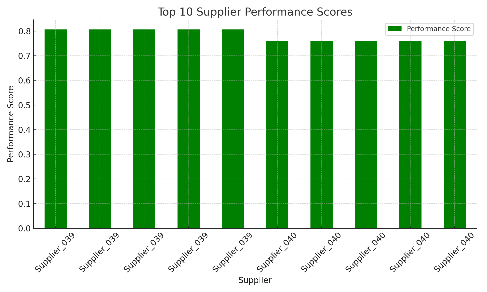

<!DOCTYPE html>
<html lang="en">
<head>
    <meta charset="UTF-8">
    <meta name="viewport" content="width=device-width, initial-scale=1.0">
</head>
<body>

<h1>Procurement Data Analysis and Optimization Project</h1>

<h2>Overview</h2>

This project focuses on optimizing procurement processes by analyzing spend data and evaluating supplier performance. The goal is to achieve cost reductions through bulk purchase discounts and renegotiating supplier contracts. The project utilizes Python for data analysis and optimization, and Tableau for data visualization.

<h2>Project Structure</h2>

<h3>1. Python Scripts</h3>
<ul>
    <li><strong>data_extraction_and_preparation.py</strong>: Loads, cleans, and prepares the procurement data for analysis.</li>
    <li><strong>spend_data_analysis.py</strong>: Analyzes spend data and generates visualizations.</li>
    <li><strong>supplier_performance_evaluation.py</strong>: Evaluates and ranks suppliers based on key performance indicators (KPIs).</li>
    <li><strong>procurement_optimization_model.py</strong>: Develops and runs a procurement optimization model to minimize costs.</li>
</ul>

<h3>2. Data Files</h3>
<ul>
    <li><strong>supplier_data.csv</strong>: Contains synthetic data on suppliers.</li>
    <li><strong>procurement_data.csv</strong>: Includes procurement transaction details.</li>
    <li><strong>performance_data.csv</strong>: Contains supplier performance metrics.</li>
    <li><strong>supplier_aggregated_data.csv</strong>: Aggregated data used for analysis.</li>
    <li><strong>top_suppliers_performance.csv</strong>: Ranked supplier performance data.</li>
    <li><strong>optimized_spends.csv</strong>: Results from the optimization model.</li>
</ul>

<h3>3. Visualizations and Dashboards</h3>

<h4>Python Visualizations:</h4>
<ul>
    <li><strong>Total Spend by Category</strong>: A bar chart showing total spend across different procurement categories.</li>
</ul>

<ul>
    <li><strong>Top 10 High-Spend Suppliers</strong>: A bar chart highlighting the top 10 suppliers based on spend.</li>
</ul>

<ul>
    <li><strong>Top 10 Supplier Performance Scores</strong>: A bar chart ranking the top suppliers based on performance metrics.</li>
</ul>

<h4>Tableau Dashboards:</h4>

In addition to Python visualizations, the project also includes interactive dashboards created in Tableau to provide further insights:

<h5>1. Spend Analysis Dashboard:</h5>
<ul>
    <li><strong>Data:</strong> supplier_aggregated_data.csv</li>
    <li><strong>Visualizations:</strong>
        <ul>
            <li>Total Spend by Category</li>
            <li>Spend Over Time</li>
            <li>Top 10 Suppliers by Spend</li>
        </ul>
    </li>
    <li><strong>Description:</strong> This dashboard provides an overview of the procurement spend, helping to identify high-cost areas and trends over time.</li>
</ul>

<h5>2. Supplier Performance Dashboard:</h5>
<ul>
    <li><strong>Data:</strong> supplier_performance_ranked.csv</li>
    <li><strong>Visualizations:</strong>
        <ul>
            <li>Supplier Performance Scores by KPIs</li>
            <li>Top Performing Suppliers</li>
            <li>Supplier Risk Analysis</li>
        </ul>
    </li>
    <li><strong>Description:</strong> This dashboard ranks suppliers based on performance metrics and highlights areas for potential improvement.</li>
</ul>

<h5>3. Optimization Recommendations Dashboard:</h5>
<ul>
    <li><strong>Data:</strong> optimized_spends.csv</li>
    <li><strong>Visualizations:</strong>
        <ul>
            <li>Recommended Spend Allocations</li>
            <li>Cost Savings Opportunities</li>
        </ul>
    </li>
    <li><strong>Description:</strong> This dashboard provides recommendations on optimal spend allocations and potential cost savings based on the optimization model.</li>
</ul>

<h3>4. SQL Queries (Optional)</h3>

If your data resides in a relational database, you can use SQL to extract and preprocess the data before analyzing it in Python or Tableau. Below are examples of SQL queries you might use:

<h4>Data Extraction:</h4>

Example SQL query to extract procurement data from a database:

<pre><code>SELECT * FROM procurement_data WHERE purchase_date >= '2023-01-01';</code></pre>

<h4>Data Aggregation:</h4>

Example SQL query to aggregate spend data by supplier:

<pre><code>SELECT supplier_id, SUM(total_spend) AS total_spend
FROM procurement_data
GROUP BY supplier_id;</code></pre>

After performing these SQL queries, you would export the results as CSV files and proceed with the Python scripts for further analysis.

<h2>How the Tableau Visualizations Were Created</h2>

<h3>1. Connecting to Data</h3>

<strong>Data Source:</strong> CSV files (supplier_data.csv, procurement_data.csv, performance_data.csv) were imported into Tableau.

<strong>Data Blending:</strong> Joined the tables using common fields like Supplier ID to combine procurement data with supplier performance metrics.

<h3>2. Building Visualizations</h3>

<strong>Spend by Category:</strong>

<ul>
    <li><strong>Chart Type:</strong> Bar Chart</li>
    <li><strong>Dimensions:</strong> Category</li>
    <li><strong>Measures:</strong> Total Spend</li>
    <li><strong>Details:</strong> Colored bars by Category.</li>
</ul>

<strong>Spend Over Time:</strong>

<ul>
    <li><strong>Chart Type:</strong> Line Chart</li>
    <li><strong>Dimensions:</strong> Date</li>
    <li><strong>Measures:</strong> Total Spend</li>
    <li><strong>Details:</strong> Aggregated by month/year.</li>
</ul>

<strong>Supplier Performance Scores:</strong>

<ul>
    <li><strong>Chart Type:</strong> Heatmap/Bar Chart</li>
    <li><strong>Dimensions:</strong> Supplier Name</li>
    <li><strong>Measures:</strong> Performance Score (calculated from normalized KPIs)</li>
    <li><strong>Details:</strong> Colored by performance.</li>
</ul>

<h3>3. Building Dashboards</h3>
<ul>
    <li><strong>Create a New Dashboard</strong> in Tableau.</li>
    <li><strong>Drag and Drop Visualizations</strong>: Place the charts you created onto the dashboard.</li>
    <li><strong>Add Filters</strong>: Enable interactivity by allowing users to filter by categories, suppliers, or time periods.</li>
    <li><strong>Title and Describe</strong>: Add titles and descriptions to guide users through the dashboard.</li>
</ul>

<h3>4. Exporting</h3>
<ul>
    <li><strong>Export the Dashboard</strong> as an image by going to File > Export As Image.</li>
    <li><strong>Share or Embed</strong>: Use the exported images in presentations, or embed the dashboard on your website or report.</li>
</ul>

<h2>How to Run the Project</h2>

<h3>Prerequisites</h3>

Ensure you have the following Python packages installed:

<ul>
    <li>pandas</li>
    <li>scipy</li>
    <li>matplotlib</li>
    <li>scikit-learn</li>
</ul>

Install the required packages using pip:

<pre><code>pip install pandas scipy matplotlib scikit-learn</code></pre>

<h3>Running the Scripts</h3>

<ol>
    <li><strong>Data Extraction and Preparation</strong></li>
</ol>
<pre><code>python data_extraction_and_preparation.py</code></pre>

<ol start="2">
    <li><strong>Spend Data Analysis</strong></li>
</ol>
<pre><code>python spend_data_analysis.py</code></pre>

<ol start="3">
    <li><strong>Supplier Performance Evaluation</strong></li>
</ol>
<pre><code>python supplier_performance_evaluation.py</code></pre>

<ol start="4">
    <li><strong>Procurement Optimization Model</strong></li>
</ol>
<pre><code>python procurement_optimization_model.py</code></pre>

<h3>Reviewing Results</h3>

After running the scripts, review the generated CSV files and Tableau dashboards for insights into procurement optimization.</
